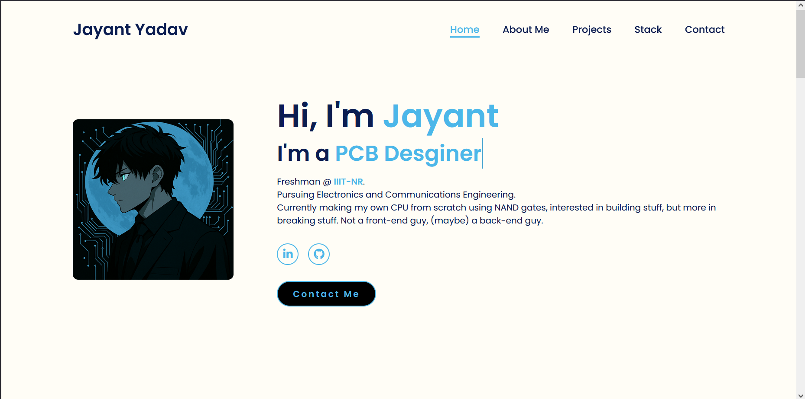

# Portfolio

This repository contains the source code and assets for a minimalist personal portfolio website.


---

## 📷 Preview



---

## 📁 Structure

```
root/
├── icons/
├── index.html
└── style.css
```
## ⚙️ Notes

- `index.html` includes a third-party JavaScript tracker for basic site analytics.
- Built using only HTML and CSS — no frameworks or build tools.
- Icons are stored locally for full control and offline usage.

---

## Release

Link: [jayant-yadav.netlify.app](jayant-yadav.netlify.app)

---
